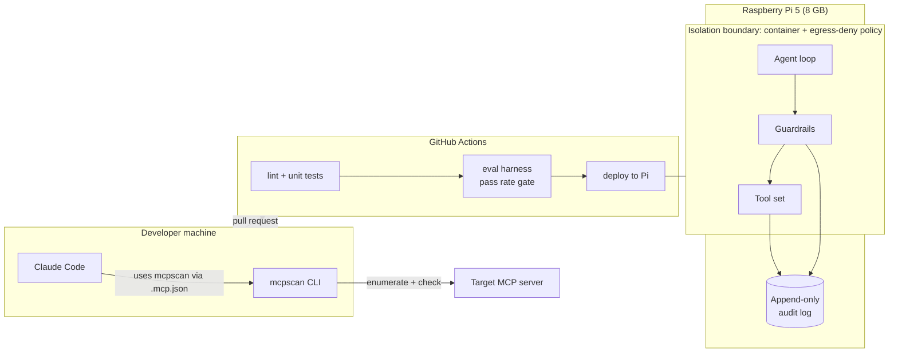

# agent-security-lab

Working code for securing agentic AI systems: a security scanner for Model Context Protocol (MCP) servers, and a hardware-isolated agent sandbox with a prompt-injection evaluation harness.

**Project status: in progress.** This repository was started on 2026-10-08. The status table below is kept accurate in every pull request. Nothing listed as "planned" should be read as finished.

## Why this exists

Agents that call tools extend the attack surface of a language model to everything the tools can reach: files, networks, credentials, other services. 2 problems follow:

1. **Supply side.** An MCP server advertises tools through descriptions and schemas that the model reads as instructions. A malicious or careless server can inject prompts, request more permission than it needs, or leak secrets through its tool surface. Nothing in the protocol stops this.
2. **Runtime side.** Even with trustworthy tools, untrusted input (web pages, documents, other agents) can steer the model into misusing them. The runtime needs an isolation boundary, guardrails, an audit trail, and a repeatable way to measure whether the guardrails hold.

This repository addresses both with code that runs, tests that gate merges, and numbers that can be checked.

## What it does

### 1. `mcpscan`: MCP server security scanner

Connects to an MCP server, enumerates its tools, resources, and prompts, and runs a set of detection checks against them. Emits a findings report where every finding is mapped to an [OWASP Top 10 for LLM Applications](https://owasp.org/www-project-top-10-for-large-language-model-applications/) category and a [MITRE ATLAS](https://atlas.mitre.org/) technique.

Planned check families:

| Check family | What it looks for |
|---|---|
| Prompt injection surfaces | Instructions to the model hidden in tool descriptions, parameter descriptions, or resource content |
| Over-permissive schemas | Tool input schemas that accept arbitrary paths, URLs, shell strings, or unconstrained objects |
| Credential and secret exposure | API keys, tokens, connection strings in tool metadata, resource listings, or prompt templates |
| Unsafe capabilities | Tools that expose raw filesystem, network, or process execution without constraint |
| Tool poisoning | Descriptions that reference other tools, instruct the model to hide behavior, or change after first listing |

### 2. Agent sandbox on Raspberry Pi 5

An LLM agent with tool use runs inside an isolation boundary on dedicated hardware. Minimum boundary is a container with an egress-deny network policy. Every tool invocation is written to an append-only audit log. Guardrails sit between the model and the tools. An evaluation harness of seeded prompt-injection and tool-misuse cases runs in CI and reports a numeric pass rate. A change that lowers the pass rate below threshold does not merge.

The threat model for this runtime is written before the sandbox code and lives in `docs/threat-model.md`.

## Architecture



## Status

| Component | Status | Notes |
|---|---|---|
| Repository skeleton, CI, lint, test runner | done | This PR |
| `mcpscan`: connect and enumerate 1 MCP server | planned | |
| `mcpscan`: detection checks | planned | Target 12 to 15 checks, each unit tested |
| `mcpscan`: OWASP LLM Top 10 and MITRE ATLAS mapping | planned | |
| `mcpscan`: deliberately vulnerable fixture server | planned | Used by CI to prove checks fire |
| Threat model for the agent runtime | planned | Written before sandbox code |
| Sandbox: container + egress-deny network policy | planned | |
| Sandbox: append-only audit log of tool calls | planned | |
| Sandbox: guardrails (tool allowlist, input and output filters, approval policy) | planned | |
| Sandbox: infrastructure as code and deploy workflow to the Pi | planned | |
| Evaluation harness with pass rate reported in CI | planned | Target 40 or more cases |
| Evaluation harness as a merge gate | planned | |
| Local model option (no egress at all) | planned | After the Claude API path works |

## Numbers

These are filled in by the code, not by hand, once the components exist.

| Metric | Value |
|---|---|
| Detection checks in `mcpscan` | 0 |
| Evaluation harness test cases | 0 |
| Current pass rate | not yet measured |

## How to run

Only the skeleton exists. These commands run lint and the smoke test.

```
git clone https://github.com/deathscythe272/agent-security-lab
cd agent-security-lab
python -m pip install -e ".[dev]"
ruff check . && ruff format --check .
pytest
```

Instructions for scanning a server and deploying the sandbox will be added when those components reach "done".

## How this repository is built

- All configuration is code. Deployment goes through GitHub Actions. Nothing is applied by hand on the Pi.
- Development history is in pull requests, 1 vertical slice per PR, so the iteration is visible.
- Claude Code is used as the development environment. `CLAUDE.md` holds the working rules. The scanner will be wired into Claude Code through `.mcp.json` so it can be invoked as a tool during development.

## What is not done

See the status table. As of the first commit, no detection checks, no sandbox, no threat model, and no evaluation harness exist. The repository is published early so the build is visible from the start.

## License

MIT
