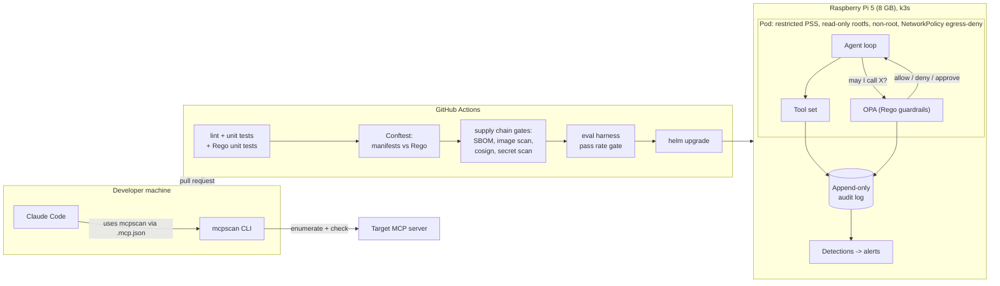

# agent-security-lab

Working code for securing agentic AI systems: a security scanner for Model Context Protocol (MCP) servers, and a hardware-isolated agent sandbox that runs as a Kubernetes workload on a Raspberry Pi 5, with guardrails written as Open Policy Agent (OPA) policies, supply chain controls in CI, a detection layer over the audit log, and a prompt-injection evaluation harness.

**Project status: in progress.** This repository was started on 2026-10-08. The status table below is kept accurate in every pull request. Nothing listed as "planned" should be read as finished.

## Why this exists

Agents that call tools extend the attack surface of a language model to everything the tools can reach: files, networks, credentials, other services. 2 problems follow:

1. **Supply side.** An MCP server advertises tools through descriptions and schemas that the model reads as instructions. A malicious or careless server can inject prompts, request more permission than it needs, or leak secrets through its tool surface. Nothing in the protocol stops this.
2. **Runtime side.** Even with trustworthy tools, untrusted input (web pages, documents, other agents) can steer the model into misusing them. The runtime needs an isolation boundary, guardrails, an audit trail, detections over that trail, and a repeatable way to measure whether the guardrails hold.

This repository addresses both with code that runs, tests that gate merges, and numbers that can be checked.

## What it does

### 1. `mcpscan`: MCP server security scanner

Connects to an MCP server, enumerates its tools, resources, and prompts, and runs a set of detection checks against them. Emits a findings report where every finding is mapped to an [OWASP Top 10 for LLM Applications](https://owasp.org/www-project-top-10-for-large-language-model-applications/) category and a [MITRE ATLAS](https://atlas.mitre.org/) technique.

Planned check families:

| Check family | What it looks for |
|---|---|
| Prompt injection surfaces | Instructions to the model hidden in tool descriptions, parameter descriptions, or resource content |
| Over-permissive schemas | Tool input schemas that accept arbitrary paths, URLs, shell strings, or unconstrained objects |
| Credential and secret exposure | API keys, tokens, connection strings in tool metadata, resource listings, or prompt templates |
| Unsafe capabilities | Tools that expose raw filesystem, network, or process execution without constraint |
| Tool poisoning | Descriptions that reference other tools, instruct the model to hide behavior, or change after first listing |

### 2. Agent sandbox on Raspberry Pi 5

An LLM agent with tool use runs inside an isolation boundary on dedicated hardware. The boundary is expressed as Kubernetes primitives on a k3s cluster, deployed with a Helm chart:

- `NetworkPolicy` with default egress deny
- Pod Security Standard at `restricted`
- Read-only root filesystem, non-root user, all capabilities dropped, seccomp profile applied

The same chart carries separate values files for the Pi and for a cloud managed cluster (EKS, GKE, or AKS), so the isolation boundary is portable.

**Guardrails as policy-as-code.** Decisions about what the agent may do are made by OPA policies written in Rego, not by conditionals in Python. Planned policy set: tool allowlist, egress-deny exceptions, filesystem path restrictions, and a class of tools that require human approval. Every policy has unit tests. A Conftest step in CI evaluates the Kubernetes manifests against a second set of Rego policies: no privileged containers, no host network, no public endpoints.

**Audit and detection.** Every tool invocation is written to an append-only audit log. A detection layer over that log emits structured alerts. Planned detections: a tool call outside the allowlist, a burst of file reads above a threshold, and any outbound network attempt. Each detection has a triage runbook and an evaluation case that is expected to trigger it.

**Evaluation harness.** Seeded prompt-injection and tool-misuse cases run in CI and report a numeric pass rate. A change that lowers the pass rate below threshold does not merge.

**Supply chain controls in CI.** Pinned dependencies, a software bill of materials (SBOM) published as a build artifact, a container image vulnerability scan that fails on critical findings, image signing with Sigstore cosign, and secret scanning before merge.

The threat model for this runtime is written before the sandbox code, in terms of the Kubernetes boundary: what the pod can reach, what it cannot, and how that is enforced. It lives in `docs/threat-model.md`.

## Architecture



## Status

| Component | Status | Notes |
|---|---|---|
| Repository skeleton, CI, lint, test runner | done | PR 1 |
| **MCP scanner** | | |
| `mcpscan`: connect and enumerate 1 MCP server | planned | |
| `mcpscan`: detection checks | planned | Target 12 to 15 checks, each unit tested |
| `mcpscan`: OWASP LLM Top 10 and MITRE ATLAS mapping | planned | |
| `mcpscan`: deliberately vulnerable fixture server | planned | Used by CI to prove checks fire |
| **Threat model** | | |
| Threat model for the agent runtime, in Kubernetes boundary terms | planned | Written before sandbox code |
| **Sandbox: Kubernetes and container security** | | |
| Helm chart with values files for Pi and a managed cloud cluster | planned | |
| `NetworkPolicy` default egress deny | planned | |
| Pod Security Standard `restricted` | planned | |
| Read-only root filesystem, non-root user, dropped capabilities, seccomp profile | planned | |
| k3s on the Pi, deployed from CI | planned | |
| **Sandbox: policy-as-code (OPA and Rego)** | | |
| Rego guardrails: tool allowlist | planned | |
| Rego guardrails: egress-deny exceptions | planned | |
| Rego guardrails: filesystem path restrictions | planned | |
| Rego guardrails: human approval required for a tool class | planned | |
| Conftest in CI over Kubernetes manifests: no privileged, no host network, no public endpoints | planned | |
| Unit tests for every Rego policy | planned | |
| **Supply chain controls in CI** | | |
| All dependencies pinned | planned | |
| SBOM generated and published as a build artifact | planned | Syft or equivalent |
| Container image vulnerability scan, fail on critical | planned | Trivy or Grype |
| Container image signed with Sigstore cosign, verification documented | planned | |
| Secret scanning as a pre-merge check | planned | gitleaks or equivalent |
| **Audit and detection** | | |
| Append-only audit log of tool calls | planned | |
| Detection: tool call outside the allowlist | planned | Structured alert + triage runbook |
| Detection: burst of file reads above threshold | planned | Structured alert + triage runbook |
| Detection: any outbound network attempt | planned | Structured alert + triage runbook |
| **Evaluation harness** | | |
| Pass rate reported in CI | planned | Target 40 or more cases |
| Cases that trigger each detection | planned | |
| Harness as a merge gate | planned | |
| **Other** | | |
| Local model option (no egress at all) | planned | After the Claude API path works |

## Numbers

These are filled in by the code, not by hand, once the components exist.

| Metric | Value |
|---|---|
| Detection checks in `mcpscan` | 0 |
| Rego policies (guardrails + manifest checks) | 0 |
| Supply chain gates in CI | 0 |
| Detections over the audit log | 0 |
| Evaluation harness test cases | 0 |
| Current pass rate | not yet measured |

## How to run

Only the skeleton exists. These commands run lint and the smoke test.

```
git clone https://github.com/deathscythe272/agent-security-lab
cd agent-security-lab
python -m pip install -e ".[dev]"
ruff check . && ruff format --check .
pytest
```

Instructions for scanning a server, deploying the chart, and verifying the image signature will be added when those components reach "done".

## How this repository is built

- All configuration is code. Deployment goes through GitHub Actions. Nothing is applied by hand on the Pi.
- Policy decisions are code too. Guardrails and manifest checks are Rego, versioned and unit tested alongside the application.
- Development history is in pull requests, 1 vertical slice per PR, so the iteration is visible.
- Claude Code is used as the development environment. `CLAUDE.md` holds the working rules. The scanner will be wired into Claude Code through `.mcp.json` so it can be invoked as a tool during development.

## What is not done

See the status table. As of this commit, only the repository skeleton and CI exist. No detection checks, no sandbox, no policies, no supply chain gates, no detections, no threat model, and no evaluation harness exist yet. The repository is published early so the build is visible from the start.

## License

MIT
